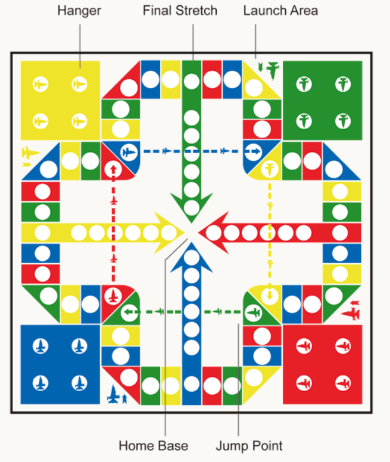

# Aeroplane Chess AI

This project implements a text-based Aeroplane chess game and experiments several AI agents, includes:
* Expectimax
* Monte Carlo Tree Search (MCTS)
* Q-Learning

## How to Run
* `Agent.py`: contains all the AI agents implementation.
* `Game.py`: main file to run, has game and player classes.
* `GameBoard.py`: contains implementation for plane, gameboard, game state.
* `utils.py`: configurations for which agent to use and whether show game state on each player move.
  * Change `AGENT1` to play game with different agents.
  * Change `CONFIG` to display or hide the game board and events.

```
pip install -r requirements.txt
python Game.py
```

## Introduction
Aeroplane chess is a popular Chinese board game, it can be played by 2 to 4 people. The game board is shown below: 



Here are the basic game rules of the Aeroplane chess game I used to implement the game:
* Each player starts with 4 planes of the same color in their hangar. 
* Each player takes turn to throw a die, the plane can go to the launch area from the hangar only when the die value is 6.
  * If a player gets a die 6, the player can then roll the die again. 
* Once on the track, planes move clockwise with the die roll.
* If a player has multiple planes on the track, they may choose which one to move.
* After moving, 
  * if the plane collides with other player's planes, it catches their planes and send them back to their hangars (they will need to wait for another die roll of 6 and start from the beginning).
    * Another version will be when there are more than 1 plane stacked together, the plane will not be able to catch them, it will be bounced back until the planes on the square leave.
  * if the plane arrives at a square with the same color, the plane can jump to the next square with the same color.
  * the plane can jump further if it's a jump point.
* In the final stretch, 
  * If the die roll exceeds the steps needed to reach the home base exactly, the plane reverses by the extra steps.
  * If it's at the dotted line when other players' plane jump through the jump point, it can also be captured.
* The **goal** is to get all planes to the home base, which requires moving 56 steps from start to finish.

## Implementation
The class diagram below shows the overall structure of my implementation:


* The arrow with the black head goes from class A to class B means class A is part of class B.
* The arrow with the white triangular head from class A to class B means class A is a subclass of class B.
  * So, AeroplaneChessAgent is the abstract class for all agents.

The most important component is the Game class, it contains every thing for the aeroplane chess game. At the start of the 
game, it initializes the first game state, then it keeps generating and tracking new game states as each player rolls die and moves planes.

### Game State Class
A game state for the aeroplane chess game is defined as:
* **Turn**: which player's turn at the current state.
* **Die roll**: die roll for the current player.
* **Planes**: all plane positions on game board at the current state.

At each player move, a new game state is generated, it checks for all events such as jumping and plane capturing, then 
the new state is returned to the game object to update the game progress. If the graphics option in `utils.py` is turned on,
a game state is displayed as follows:

```python
'''
B player rolled Die: 3
Player B moved plane 1
3 planes left.


=================================Main track==============================================================
E                                             F     E                                             F    
R B Y G R B Y G R B Y G R B Y G R B Y G R B Y G R B Y G R B Y G R B Y G R B Y G R B Y G R B Y G R B Y G
                                                                                            1          
                                                                                            B          
========================================Final Stretches==================================================
=============================================B===========================================================
B B B B B B B
                                                                                                       
                                                                                                       
=============================================G===========================================================
G G G G G G G
        1                                                                                              
        G                                                                                              

Type enter to continue...
'''
```

The game state display information includes:
* Die roll
* Action taken by player
* Number of planes left for the player to win
* All plane positions on the game board

Between main track and final stretches annotations is the text display for main track: 
* first line is the annotation for entrances and final stretch entrances for the Blue and Green player.
  * E = main track entrance
  * F = final stretch entrance
* second line is the color letter for all main track squares (R = Red, B = Blue, Y = Yellow, G = Green)
* next two lines represent the number of planes in the same position and the color of the planes

After the final stretches annotations are the final stretches for each player similar to main track. I run experiments only with 
the Blue player and Green player for simplicity because they are the two players that can capture each other in final stretches.

When a player wins the game, it will display who wins the game:
```python
'''
B player got a plane finished!

Player B wins the game!
B player rolled Die: 2
Player B moved plane 3


=================================Main track==============================================================
E                                             F     E                                             F    
R B Y G R B Y G R B Y G R B Y G R B Y G R B Y G R B Y G R B Y G R B Y G R B Y G R B Y G R B Y G R B Y G
                        1     1                                                                        
                        G     G                                                                        
========================================Final Stretches==================================================
=============================================B===========================================================
B B B B B B B
                                                                                                       
                                                                                                       
=============================================G===========================================================
G G G G G G G
'''
```

## AI Agent Implementation
The agent controls how the player will move the planes on the game board. The general idea is that given a game state and die roll, 
the agent chooses which plane to move if there is movable planes (can be none if all the planes are on hangar and die value is not 6).
The easiest agent to implement is **Random Agent**, it just randomly pick a plane from the movable plane list. This project compares 
AI algorithms with the random agent to see which may be better at this game.

### Expectimax Agent
The expectimax algorithm is very similar to what I implemented in the Pacman project. I have only one opponent, so it's simpler 
than in the Pacman homework, the max and min agent need to only check for a special case which is when the die roll is 6, 
which means that the max or min will be able to take another move. The algorithm is shown here:

```python
def _max(self, state, die_v, depth):
    movable_planes_inx = state.get_movable_planes(die_v)
    if state.is_win(self.color) or state.is_lose(self.color) or depth > MAX_DEPTH or len(movable_planes_inx) == 0:
        return self.evaluate_state(state), None
    move = None
    v = -float('inf')

    for a in movable_planes_inx:
        expected_v2 = 0
        new_state = state.generate_successor(a, die_v)
        # When die is 6, the next will still be max player
        for die_v2 in range(1, 7):
            if die_v == 6:
                v2, _ = self._max(new_state, die_v2, depth + 1)
            else:
                v2, _ = self._min(new_state, die_v2, depth + 1)
            expected_v2 += v2
        expected_v2 /= 6
        if expected_v2 > v:
            v, move = expected_v2, a
    return v, move

def _min(self, state, die_v, depth):
    movable_planes_inx = state.get_movable_planes(die_v)
    if state.is_win(self.color) or state.is_lose(self.color) or depth > MAX_DEPTH or len(movable_planes_inx) == 0:
        return self.evaluate_state(state), None
    move = None
    expected_v = 0

    for a in movable_planes_inx:
        expected_v2 = 0
        new_state = state.generate_successor(a, die_v)
        for die_v2 in range(1, 7):
            # When die is 6, the next will still be min player
            if die_v == 6:
                v2, a2 = self._min(new_state, die_v2, depth + 1)
            else:
                v2, a2 = self._max(new_state, die_v2, depth + 1)
            expected_v2 += v2
        expected_v2 /= 6
        expected_v += expected_v2
    if len(movable_planes_inx) > 0:
        expected_v /= len(movable_planes_inx)
    return expected_v, move
```

In this project I tried to limit the tree depth to 2 and 3, both of them got very good results. 

### MCTS Agent
Monte Carlo tree search agent basically simulates the game multiple times and choose the best action from the simulation. 
The algorithm in the text book is very simple:
* **Select**: select the child using UCB1 policy until leaf is reached.
  * **Upper-Confidence Bounds (UCB)**: a selection policy
  * I also select a node if the node is not fully expanded, because if always select child, then it will not be a tree, it will be a straight line.
* **Expand**: expand and explore one of neighbor state of the leaf.
  * Similarly, if the node is not fully explored, explore other actions not in the expanded states.
* **Simulate**: simulate game states afterwards and get the results.
  * I set the simulation iteration to 100.
* **Backpropagate**: send the result back to the root, update the nodes along the way.

The entire algorithm is repeated for a number of times when it's the agent's turn. I experimented both 10 and 100, the decision time will 
become too long if the algorithm is run 1000 times for each action.

### Q-Learning Agent
I implemented the epsilon-greedy Q-learning found in [Geeks for geeks](https://www.geeksforgeeks.org/q-learning-in-python/). 
Before the game starts, the agent will simulate the game for a certain number of times to get a relatively good Q table, then 
it starts playing the real game. I tried simulating 1000 games before it starts playing, more games didn't seem to improve its performance.


## Results
I ran 100 games for each agent against the Random Agent who controls the Green player. The tables 
below show the experiment results with different agents and configurations, Table 1 records the win ratio (Blue:Green)
and Table 2 has the average time taken for an agent to choose a move. The bolded results are the best or shortest run time 
(exclude Random Agent). The best AI agent is Expectimax with search depth of 3, and depth 2 is very close to it, 
the worst agent is the random agent. And the fastest AI agent is Q-learning, it's almost as fast as random agent, although 
it's not as good as other agents. Expectimax with depth 2 is significantly faster than depth 3 and has only slightly worse 
results. So, Expectimax agent is best for Aeroplane chess game with only two players. 

| **Blue Player Agent**         | **Green Player Agent** | **Wins(B:G, 100 Games)** |
|-------------------------------|------------------------|--------------------------|
| Random Agent                  | Random Agent           | 51:49                    |
| Expectimax Agent (Depth=2)    | Random Agent           | 80:20                    |
| Expectimax Agent (Depth=3)    | Random Agent           | **82:18**                |
| Monte Carlo Agent (N=10)      | Random Agent           | 58:42                    |
| Monte Carlo Agent (N=100)     | Random Agent           | 63:37                    |
| Q-Learning Agent (Epoch=1000) | Random Agent           | 62:38                    |
**Table 1**: Blue agents vs. Green agents win ratio (100 games).


| **Agent Type**              | **Ave Decision Time (s)** |
|-----------------------------|---------------------------|
| Random Agent                | 0.00000                   |
| Expectimax Agent (Depth=2)  | 0.28689                   |
| Expectimax Agent (Depth=3)  | 5.07888                   |
| Monte Carlo Agent (N = 10)  | 9.39260                   |
| Monte Carlo Agent (N = 100) | 77.77000                  |
| Q-Learning                  | **0.00135**               |
**Table 2**: Each agent's average running time for making decisions.

## Conclusion
The Expectimax agent with limited search depth of 2 is best for the Aeroplane chess with 2 players, if given more time it'll 
be interesting to see if Expectimax can maintain its performance when there are 4 players. Also, a GUI will be more intuitive 
than text. 


